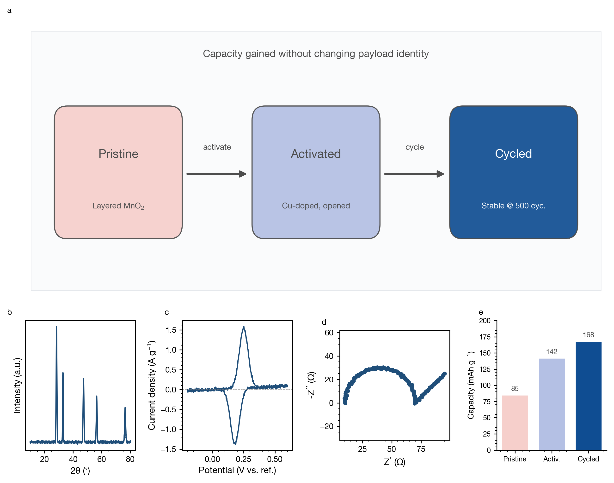
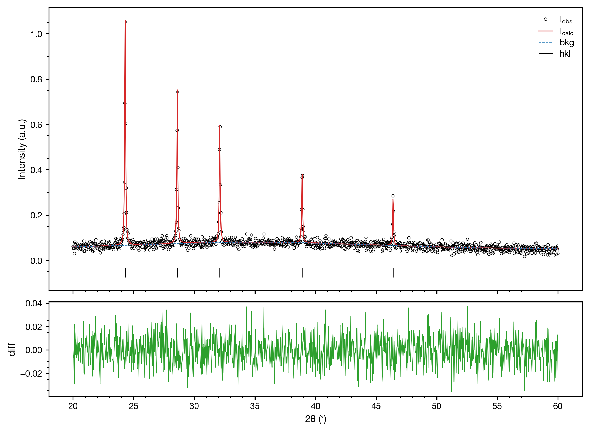
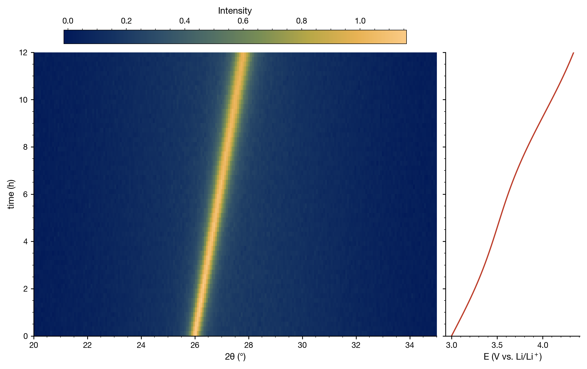
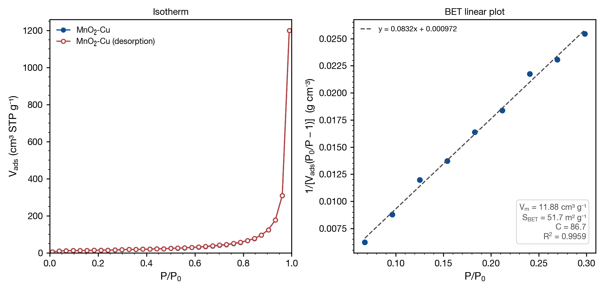
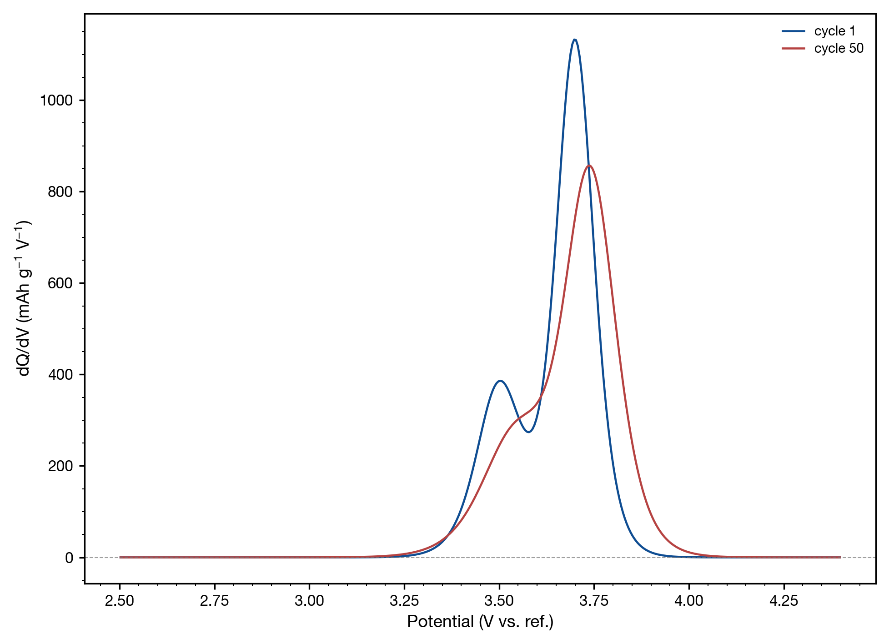
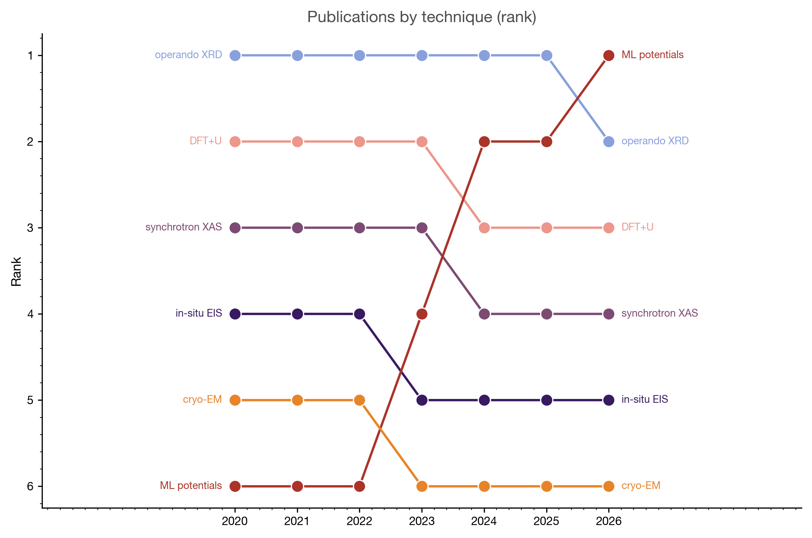
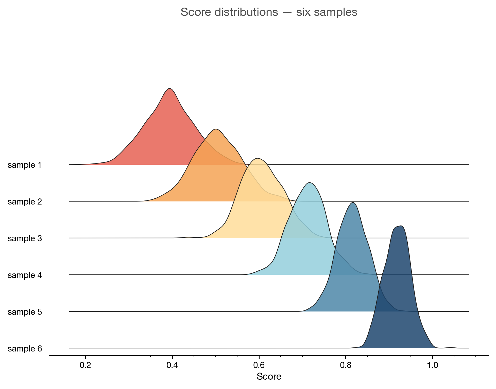
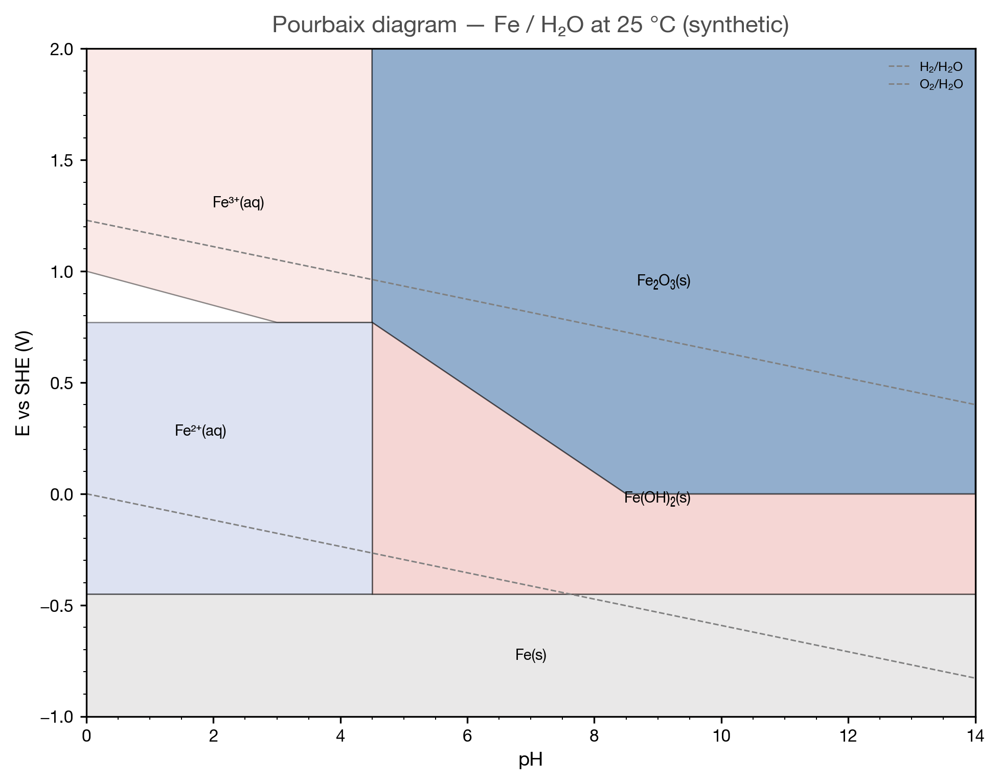
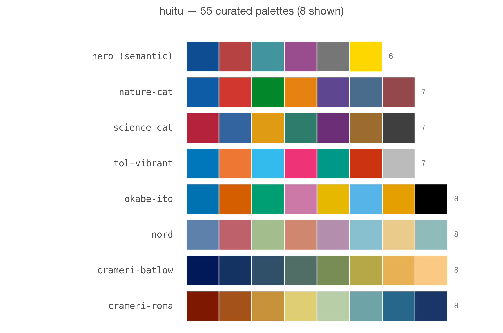

# huitu

> 材料科学一键式科研绘图工具包 — Journal-ready figures for materials-science papers.

[](https://www.python.org/)
[](LICENSE)
[](https://matplotlib.org/)
[]()
[]()

`huitu` 把 matplotlib + scienceplots 包装成"一行出图"的体验：

* **46 个 ready-to-use 绘图函数**，覆盖材料学论文里最常见的表征 / 电化学 /
  第一性原理 / 高级统计 / 原位 (operando) 谱图。
* **8 大期刊预设**（Nature / Science / ACS / RSC / Wiley / Elsevier / IEEE
  / default），尺寸、字号、字重、刻度、配色一次性符合规范。
* **600 dpi 默认保存**，达到 Nature/Science/RSC 印刷标准，永远不糊。
* **可编辑 SVG/PDF 文字** ✨ — 默认 `svg.fonttype="none"` + `pdf.fonttype=42`，
  保存出来的图在 Illustrator / Inkscape 里能选中改字，不再被栅格成路径。
* **语义调色板** ✨ — `huitu.role("hero")` / `role("baseline")` / `role("positive")`
  按"科学角色"取色，整页所有 panel 都能保持配色一致。
* **4 大 Nature 排版 archetype** ✨ —
  `archetype.schematic_led` / `dark_image_plate` / `clinical_triptych` /
  `asymmetric_hero`，按论证类型而不是 `subplot(2,3)` 拼图。
* **投稿 QA 工具** ✨ — `check_redundancy()` 检查多 panel 信息是否冗余，
  `reviewer_checklist()` 给出 reviewer 可能挑刺的字段清单。
* **55 个调色板**（ggsci / Met-Brewer / Financial Times / Tol / Okabe-Ito /
  CARTO / Crameri / Nord / Editorial …），无需额外安装。

```python
import huitu

huitu.use_journal("nature")
huitu.plot_xrd("data.txt", save="fig1.svg")          # ✨ SVG 文字可编辑
huitu.plot_ridgeline(distributions, save="ridge.png")
huitu.plot_operando_xrd_echem(Z, x=q, y=t, echem=V, save="operando.pdf")

# v0.5 新加：用语义角色取色
ax.plot(t, y_mine, color=huitu.role("hero"),     label="Ours")
ax.plot(t, y_ref,  color=huitu.role("baseline"), label="Ref")

# v0.5 新加：4 大 Nature archetype 排版
fig, ax = huitu.archetype.schematic_led(journal="nature", n_supports=4)
ax["hero"].imshow(schematic_image)
huitu.plot_xrd("xrd.txt", ax=ax["supports"][0])
```

---

## 🖼 Showcase

9 representative figures across huitu's full surface — every one rendered by `python docs/showcase/render.py` at ≥ 1900 px native, 300 dpi, editable-text SVG / PDF available.

| Multi-panel Nature Fig 1 | Rietveld refinement | Operando XRD + galvanostatic |
|---|---|---|
|  |  |  |

| BET isotherm + linear (v0.6) | dQ/dV multi-cycle (v0.6) | Bump — rank evolution |
|---|---|---|
|  |  |  |

| Ridgeline distributions | Pourbaix (E-pH) diagram | Palette catalog |
|---|---|---|
|  |  |  |

> All 9 regenerable with one command: `python docs/showcase/render.py` — no manual data files needed.

---

## 📦 安装

`huitu` 有**两条互不冲突**的安装路径——你可以同时用，也可以只用一条。

### A. 作为 Python 包 (`import huitu`)

写代码 / 跑脚本 / Jupyter 里用：

```bash
git clone https://github.com/yinliang420/Scientific_Illustration.git
cd Scientific_Illustration
pip install -e .                  # 主包
pip install -e ".[crystal]"       # 加上 ASE 晶体渲染
pip install -e ".[dev]"           # 加上 pytest / build / twine
```

或者从 [Releases](https://github.com/yinliang420/Scientific_Illustration/releases) 下载 `huitu-0.6.3-py3-none-any.whl`：

```bash
pip install huitu-0.6.3-py3-none-any.whl
```

依赖：Python ≥ 3.9、matplotlib ≥ 3.7、numpy ≥ 1.23、pandas ≥ 1.5、scipy ≥ 1.10、scienceplots ≥ 2.0、Pillow ≥ 9.0。

### B. 作为 Claude Code / Codex 智能体 SKILL

让 Claude Code / Codex 在你说 **"帮我画 XRD"** / **"plot a CV curve"** / **"BET 等温线"** / **"reviewer checklist"** 之类的查询时**自动激活** huitu——无需 `import` 也不用手写代码：

#### Claude Code

```bash
# 整个 huitu_skills 仓库目录复制到 ~/.claude/skills/huitu/
cp -R Scientific_Illustration ~/.claude/skills/huitu

# 或保留软链（仓库 git pull 后会自动跟新）
ln -s "$PWD/Scientific_Illustration" ~/.claude/skills/huitu
```

验证：

```bash
ls ~/.claude/skills/huitu/SKILL.md && \
  head -3 ~/.claude/skills/huitu/SKILL.md
# 应输出: ---  / name: huitu  / description: >-
```

下次 Claude Code 会话只要触发词出现在你的 query 中（见 [SKILL.md](SKILL.md) `## When to use this skill`），huitu 就会被自动加载。

#### Codex CLI

Codex 用同样的 skill 协议；安装路径是 `~/.codex/skills/`：

```bash
mkdir -p ~/.codex/skills/
cp -R Scientific_Illustration ~/.codex/skills/huitu
# 验证（应该看到 frontmatter 前 3 行）
head -3 ~/.codex/skills/huitu/SKILL.md
```

如果你用 Codex plugin marketplace 管理 skill，把 huitu_skills 当成一个 skill 包发布到 marketplace 也可以。

#### 卸载

```bash
rm -rf ~/.claude/skills/huitu     # Claude Code
rm -rf ~/.codex/skills/huitu      # Codex
```

不影响 `pip install` 的 Python 包；两条安装路径互相独立。

> ⚠️ **同时也得装 Python 包**：smart agent 调起 huitu 后，最终会跑 `python -c "import huitu; huitu.plot_xrd(...)"`，所以**两条路径建议都装**。仅装 skill 不装 pip 包 → agent 看得到 API catalogue 但无法真正出图。

---

## 🚀 快速开始

```python
import huitu

# 1. 单图
huitu.plot_xrd("xrd.txt", journal="nature", save="xrd.pdf")

# 2. 多面板拼版
fig, axes = huitu.make_subplots(1, 2, journal="acs")
huitu.plot_xrd("xrd.txt",   ax=axes[0])
huitu.plot_raman("raman.txt", ax=axes[1])
fig.savefig("panel.pdf")

# 3. 高级统计图（v0.4 新加）
huitu.plot_ridgeline(distributions, labels=samples, save="ridge.png")
huitu.plot_bump(rankings, x_labels=years, save="bump.png")

# 4. Operando / 原位（v0.4 新加）
huitu.plot_operando_xrd_echem(
    Z,                           # 2D intensity matrix (M, N)
    x=two_theta, y=time,
    echem=voltage,
    xlabel=r"2$\theta$ (°)", ylabel="time (s)", ec_label="E (V)",
    save="operando.png",
)
```

每个 `plot_*` 函数都返回 `(fig, ax)`，并接受四种输入：路径字符串 / NumPy
`(N, 2)` 数组 / `(x, y)` 元组 / pandas DataFrame。

---

## 📑 覆盖的图类型（46 个）

| 类别 | 函数 |
|---|---|
| 表征谱图 | `plot_xrd` · `plot_xps` · `plot_raman` · `plot_ftir` · `plot_uvvis` · `plot_pl` · `plot_thermal` · `plot_rietveld` · `plot_operando` |
| 电化学 | `plot_cv` · `plot_gcd` · `plot_cycle` · `plot_eis` · `plot_bode` · `plot_tafel` |
| 第一性原理 | `plot_band` · `plot_dos` · `plot_cohp` · `plot_pourbaix` · `plot_phase_diagram` |
| 晶体结构 | `plot_crystal_ase` · `plot_crystal_vesta` |
| 通用数据图 | `plot_bar` · `plot_scatter` · `plot_line` · `plot_heatmap` · `plot_box_violin` · `plot_radar` · `plot_density` · `plot_shap` |
| **统计 / 比较** ✨ | `plot_ridgeline` · `plot_dumbbell` · `plot_slope` · `plot_bump` · `plot_parallel` · `plot_waffle` · `plot_streamgraph` · `plot_connected_scatter` |
| **原位 / Operando** ✨ | `plot_operando_waterfall` · `plot_operando_xrd_echem` · `plot_operando_3d_surface` · `plot_operando_diffmap` · `plot_operando_peak_evolution` · `plot_operando_contour` |
| 排版 | `make_subplots` · `add_inset` · `share_axes` · `panel_tag` · `supertitle` |
| **Nature archetype** ✨ v0.5 | `archetype.schematic_led` · `archetype.dark_image_plate` · `archetype.clinical_triptych` · `archetype.asymmetric_hero` |
| **投稿 QA** ✨ v0.5 | `role` · `check_redundancy` · `print_redundancy_report` · `reviewer_checklist` |

✨ = v0.4 新增统计/operando（原本付费 Pro），v0.5 新加 Nature 风格 archetype + QA 工具。

---

## ✨ v0.5 — Nature-style 升级

### 1. 可编辑 SVG / PDF（不用动代码，改个 rcParams 默认值）

每个期刊预设现在都包含：

```python
"svg.fonttype": "none"   # 文本保留为 <text> 节点
"pdf.fonttype": 42       # PDF 嵌入 TrueType
"ps.fonttype":  42
```

保存出来的 `.svg`、`.pdf` 文字都能在 Illustrator / Inkscape 选中、改字号、对齐 ——
评审拿到 figure 不会被"文字变成贝塞尔曲线"卡住。

### 2. 语义调色板：按"科学角色"取色

```python
ax.plot(t, y_mine, color=huitu.role("hero"),     label="Ours")
ax.plot(t, y_ref,  color=huitu.role("baseline"), label="Reference")
ax.scatter(xg, yg, color=huitu.role("positive"), marker="^")  # 涨
ax.scatter(xd, yd, color=huitu.role("negative"), marker="v")  # 跌
```

18 个角色键值对：

| 类别 | 键 | 用途 |
|---|---|---|
| 自己的方法 | `hero` / `hero_2` / `hero_soft` | 主方法、第二变体、第三变体 |
| 对照 / 参比 | `baseline` / `baseline_2` / `baseline_soft` | 控制组、副参比 |
| 方向性 | `positive` / `positive_soft` / `negative` / `negative_soft` | 涨 ↑ / 跌 ↓ |
| 中性 | `neutral` / `neutral_light` / `neutral_dark` / `neutral_black` | 背景、参考线 |
| 强调 | `accent_gold` / `accent_teal` / `accent_violet` / `accent_magenta` | callout、荧光通道 |

也可以一次性切换全图：`huitu.use_palette("semantic")`。

### 3. 四大 Nature 排版 archetype

```python
# 顶部 schematic + 底部 quant supports（材料/机理论文最常用）
fig, ax = huitu.archetype.schematic_led(journal="nature", n_supports=4)
ax["hero"].imshow(schematic_image)
huitu.plot_xrd("xrd.txt",   ax=ax["supports"][0])
huitu.plot_eis("eis.txt",   ax=ax["supports"][1])
huitu.plot_cycle("life.txt",ax=ax["supports"][2])
huitu.plot_cv("cv.txt",     ax=ax["supports"][3])

# 显微 / 荧光黑底 grid
fig, grid = huitu.archetype.dark_image_plate(rows=3, cols=5, journal="nature")
for r, row in enumerate(grid):
    for c, ax in enumerate(row):
        ax.imshow(microscopy[r][c])

# 临床 / 纵向"三段"：trajectories → forest → summary bars
fig, ax = huitu.archetype.clinical_triptych()  # ax['top'/'mid'/'bot'] 各 3 列

# 不对称：一个 panel 跨 3 行（UMAP / 圆形基因组图 / 大示意图）
fig, ax = huitu.archetype.asymmetric_hero()
ax["e"].set_title("hero panel")  # 跨行
```

每个 archetype 自动调用 `use_journal()`，画好小写粗体 panel label（a / b / c …），
继承当前预设的 600 dpi + 可编辑 SVG 默认值。

### 4. Anti-redundancy 检查

```python
huitu.print_redundancy_report([
    {"id": "a", "question": "What is the composition?",
     "encoding": "stacked_bar",     "level": "overview"},
    {"id": "b", "question": "What is atypical per group?",
     "encoding": "z_score_heatmap", "level": "deviation"},
    {"id": "c", "question": "How do tumor and immune % co-vary?",
     "encoding": "bubble_scatter",  "level": "relationship"},
])
# → [OK] no redundancy issues detected (3 panels).
```

会自动报警的情况：

- 两个 panel 在回答**同一个**科学问题
- 同一份 data slice 被两种图重复表达（堆叠柱 + 饼图）
- 缺少 **Overview → Deviation → Relationship** 三层信息层级中的某一层
- 两个 ranked-bar（应该把其中一个换成散点 / 气泡）

### 5. Reviewer-risk checklist

```python
rep = huitu.reviewer_checklist(
    figure={
        "core_conclusion": "Cu-doped MnO2 raises capacity by 32 %",
        "archetype": "schematic-led",
        "final_size": "183 mm × 130 mm",
    },
    quantitative={
        "n": "n=12 cells / group",
        "biological_replicates": 3,
        "center": "median", "spread": "IQR",
        "test": "two-sided Wilcoxon",
        "source_data": "fig3.csv",
    },
    image={"scale_bar": "50 µm", "raw_file": "raw/fig3a.tif"},
)
# 打印 PASS / FAIL，列出 [OK] [!!] required 缺失 / [??] recommended 缺失
# 还返回结构化 dict 给 CI 用：rep["pass"], rep["n_required_missing"]
```

四个可选 metadata 块：`figure` / `quantitative` / `image` / `machine_learning`。
每条对应 Springer Nature & Cell-family 期刊真实的 pre-submission checklist。

---

## 🎨 调色板

```python
huitu.list_palettes()              # 55 个，按字母排序
huitu.use_palette("met-hiroshige") # 全局应用
cmap = huitu.get_cmap("crameri-batlow")
```

* **ggsci** — npg, aaas, jco, lancet, jama, nejm, frontiers, bmj, futurama,
  simpsons, startrek, tron, uchicago, d3, observable10
* **MetBrewer** — hiroshige, hokusai1/3, isfahan1, vangogh3, cassatt2,
  okeeffe2, tam, archambault, renoir, manet, derain, juarez, redon, johnson,
  egypt, klimt, kandinsky, monet
* **Financial Times** — categorical, diverging, sequential, night
* **基础** — tol-bright/muted/vibrant, okabe-ito, carto-safe/bold, nord,
  editorial, viridis6, nature-cat, nature-muted, science-cat, crameri-batlow,
  crameri-roma, bold-qualitative

---

## 📐 期刊预设

| 预设 | 默认色卡 | figsize | DPI |
|---|---|---|---|
| `default` | editorial | 3.5 × 2.8 in | 600 |
| `nature` | nature-cat | 89 × 70 mm | 600 |
| `science` | science-cat | 110 × 88 mm | 600 |
| `acs` | bold-qualitative | 3.33 × 2.5 in | 600 |
| `rsc` | tol-vibrant | 3.26 × 2.6 in | 600 |
| `wiley` | nord | 3.35 × 2.6 in | 600 |
| `elsevier` | okabe-ito | 90 × 70 mm | 600 |
| `ieee` | carto-safe | 3.5 × 2.5 in | 600 |

---

## 📚 文档

* **[SKILL.md](SKILL.md)** — 完整 API catalog · 期刊预设详表 · quirks · 数据格式规范 · inline 快速上手代码块
* **[REPO_LAYOUT.md](REPO_LAYOUT.md)** — 仓库结构 · 每个目录职责 · "怎么加新 plot 类型"
* **[CHANGELOG.md](CHANGELOG.md)** — 版本变更记录
* `examples/` — 6 个核心示范脚本（quickstart · multi_panel · bet · dqdv · pdf_report · reviewer_checklist），逐函数 API 见每个 `plot_*` 的 docstring

---

## 🧪 测试

```bash
python -m pytest tests/ -v
# 237 passed
```

---

## 📂 项目结构

```
huitu/
├── __init__.py                  # 46 plot_* + role + archetype + QA 顶层 API
├── style.py                     # 8 期刊预设 + 55 调色板（含 semantic）+ 600 dpi + 可编辑 SVG/PDF
├── archetype.py                 # ✨ v0.5 — 4 个 Nature 排版 (schematic_led / dark_image_plate / clinical_triptych / asymmetric_hero)
├── review.py                    # ✨ v0.5 — check_redundancy + reviewer_checklist
├── _common.py                   # 输入归一化 / axes 准备 / 注释边界保护
├── readers/txt_csv.py           # 支持 # / % 注释，tab/空白/逗号分隔
├── characterization/            # xrd, xps, raman, ftir, uvvis, pl, thermal, rietveld, operando
├── electrochem/                 # cv, gcd, cycle, eis, bode, tafel
├── computational/               # band, dos, cohp, pourbaix, phase_diagram, crystal
├── general/                     # bar, scatter, line, heatmap, box_violin, radar, density, shap
├── layout/                      # subplots, inset, shared_axes
└── pro/                         # legacy 命名空间 — v0.4 起作为别名
    ├── palettes.py              # 39 个 premium 调色板
    └── ridgeline.py / comparison.py / advanced.py / operando_pro.py
examples/                        # 6 个核心示范脚本 + sample_data/
tests/                           # 237 个 pytest
docs/showcase/                   # README 用的 9 张展示图
```

---

## 🚢 打包 & 分发

```bash
pip install build
python -m build           # → dist/huitu-0.6.3-py3-none-any.whl + .tar.gz
```

把 `.whl` 发给同事即可：

```bash
pip install huitu-0.6.3-py3-none-any.whl
```

---

## 🗺 路线图

* **v0.1** — 10 MVP 图（XRD/XPS/Raman/CV/GCD/Cycle/EIS/Bar/Scatter/Line）
* **v0.2** — +10：FTIR / UV-Vis / PL / TGA-DSC / Bode / Tafel / Band / DOS / Heatmap / Box-Violin
* **v0.3** — +7：Rietveld / COHP / Pourbaix / Phase diagram / Radar / Crystal + `share_axes`
* **v0.4** — +14 高级 / 原位图，Pro 全开，600 dpi 默认，39 个 premium 调色板，标签边界严格保护
* **v0.5.0** — Nature-style 升级：可编辑 SVG/PDF 文字 · 18-key 语义调色板（`role()`） · 4 大排版 archetype · anti-redundancy 检查 · reviewer-risk checklist
* **v0.5.1 / v0.5.2** — 3 轮 4-agent 对抗迭代加固（14 个 bug）
* **v0.6.0** — pymatgen `BSVasprun` · `plot_bet` · `plot_dqdv` · `make_pdf_report`；examples/ 瘦身到 6 个核心示范；删 inspirations/ + real_data_test/ + USAGE.md + hardening 案例研究，仓库结构最精简
* **v0.6.1 / v0.6.2 / v0.6.3 (current)** — round-4 polish、round-5 视觉审计（52 图 harness）、round-6 xy-label 查缺补漏；测试套涨到 237
* **v0.7 (planned)** — 公开 `huitu.finalize` · `figure_contract()` helper · BET multi-sample comparator

---

## 🤝 贡献

新加一种图的最小步骤：

1. 在对应 `huitu/<subpackage>/` 下写新 `plot_*` 函数
2. 在 `huitu/__init__.py` 顶层导出
3. 在 `SKILL.md` 的 Plot catalogue 表格加一行（Function + Source + Notes）；调用示例放在函数 docstring 里
4. 在 `tests/test_smoke.py` 参数化列表里加 preset 覆盖

完整清单见 [REPO_LAYOUT.md](REPO_LAYOUT.md)。

---

## 📄 License

MIT — 详见 [LICENSE](LICENSE)。
