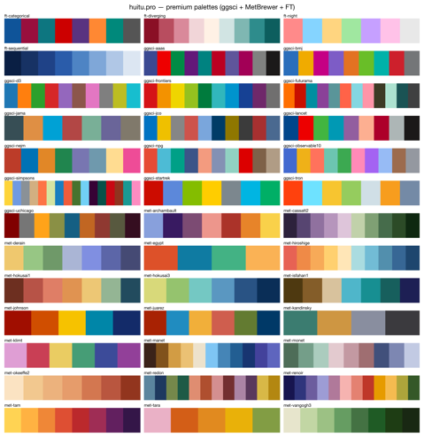
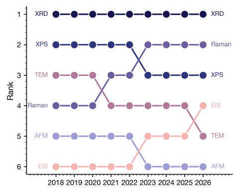
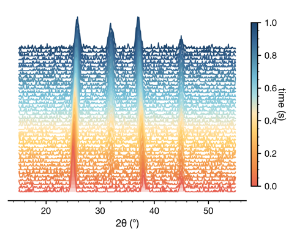
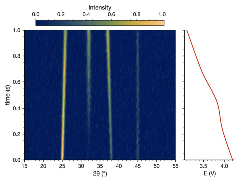
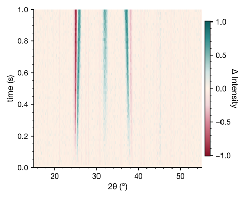
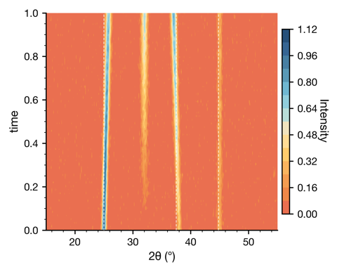

# huitu

> 材料科学一键式科研绘图工具包 — Journal-ready figures for materials-science papers.

[](https://www.python.org/)
[](LICENSE)
[](https://matplotlib.org/)
[]()

`huitu` 把 matplotlib + scienceplots 包装成"一行出图"的体验：

* **44 个 ready-to-use 绘图函数**，覆盖材料学论文里最常见的表征 / 电化学 /
  第一性原理 / 高级统计 / 原位 (operando) 谱图。
* **8 大期刊预设**（Nature / Science / ACS / RSC / Wiley / Elsevier / IEEE
  / default），尺寸、字号、字重、刻度、配色一次性符合规范。
* **600 dpi 默认保存**，达到 Nature/Science/RSC 印刷标准，永远不糊。
* **54 个调色板**（ggsci / Met-Brewer / Financial Times / Tol / Okabe-Ito /
  CARTO / Crameri / Nord / Editorial …），无需额外安装。
* **零 license**：所有功能默认开放，没有 VIP 闸门。

```python
import huitu

huitu.use_journal("nature")
huitu.plot_xrd("data.txt", save="fig1.pdf")          # 600 dpi automatically
huitu.plot_ridgeline(distributions, save="ridge.png")
huitu.plot_operando_xrd_echem(Z, x=q, y=t, echem=V, save="operando.pdf")
```

---

## 🖼 Showcase

| Palettes | Bump (rank evolution) | Operando waterfall |
|---|---|---|
|  |  |  |

| Operando XRD + electrochem | Operando diffmap | Operando contour |
|---|---|---|
|  |  |  |

> 完整 322 张高级图 gallery 在 `real_data_test/test_pro_gallery.py`，跑一次
> 即可在本地生成。

---

## 📦 安装

### 从 wheel 装（推荐分享给同事）

下载 [`dist/huitu-0.4.0-py3-none-any.whl`](dist/) 后：

```bash
pip install huitu-0.4.0-py3-none-any.whl
# 可选：晶体结构渲染（ASE）
pip install "huitu[crystal]" --find-links .
```

### 从源码装（开发用）

```bash
git clone https://github.com/<your-username>/huitu.git
cd huitu
pip install -e .                  # 主包
pip install -e ".[crystal]"       # 加上 ASE 晶体渲染
pip install -e ".[dev]"           # 加上 pytest / build / twine
```

依赖：Python ≥ 3.9、matplotlib ≥ 3.7、numpy ≥ 1.23、pandas ≥ 1.5、
scipy ≥ 1.10、scienceplots ≥ 2.0、Pillow ≥ 9.0。

---

## 🚀 快速开始

```python
import huitu

# 1. 单图
huitu.plot_xrd("xrd.txt", journal="nature", save="xrd.pdf")

# 2. 多面板拼版
fig, axes = huitu.make_subplots(1, 2, journal="acs")
huitu.plot_xrd("xrd.txt",   ax=axes[0])
huitu.plot_raman("raman.txt", ax=axes[1])
fig.savefig("panel.pdf")

# 3. 高级统计图（v0.4 新加）
huitu.plot_ridgeline(distributions, labels=samples, save="ridge.png")
huitu.plot_bump(rankings, x_labels=years, save="bump.png")

# 4. Operando / 原位（v0.4 新加）
huitu.plot_operando_xrd_echem(
    Z,                           # 2D intensity matrix (M, N)
    x=two_theta, y=time,
    echem=voltage,
    xlabel=r"2$\theta$ (°)", ylabel="time (s)", ec_label="E (V)",
    save="operando.png",
)
```

每个 `plot_*` 函数都返回 `(fig, ax)`，并接受四种输入：路径字符串 / NumPy
`(N, 2)` 数组 / `(x, y)` 元组 / pandas DataFrame。

---

## 📑 覆盖的图类型（44 个）

| 类别 | 函数 |
|---|---|
| 表征谱图 | `plot_xrd` · `plot_xps` · `plot_raman` · `plot_ftir` · `plot_uvvis` · `plot_pl` · `plot_thermal` · `plot_rietveld` · `plot_operando` |
| 电化学 | `plot_cv` · `plot_gcd` · `plot_cycle` · `plot_eis` · `plot_bode` · `plot_tafel` |
| 第一性原理 | `plot_band` · `plot_dos` · `plot_cohp` · `plot_pourbaix` · `plot_phase_diagram` |
| 晶体结构 | `plot_crystal_ase` · `plot_crystal_vesta` |
| 通用数据图 | `plot_bar` · `plot_scatter` · `plot_line` · `plot_heatmap` · `plot_box_violin` · `plot_radar` · `plot_density` · `plot_shap` |
| **统计 / 比较** ✨ | `plot_ridgeline` · `plot_dumbbell` · `plot_slope` · `plot_bump` · `plot_parallel` · `plot_waffle` · `plot_streamgraph` · `plot_connected_scatter` |
| **原位 / Operando** ✨ | `plot_operando_waterfall` · `plot_operando_xrd_echem` · `plot_operando_3d_surface` · `plot_operando_diffmap` · `plot_operando_peak_evolution` · `plot_operando_contour` |
| 排版 | `make_subplots` · `add_inset` · `share_axes` · `panel_tag` · `supertitle` |

✨ = v0.4 新增，原本是付费 Pro 模块，现已全部开放。

---

## 🎨 调色板

```python
huitu.list_palettes()              # 54 个，按字母排序
huitu.use_palette("met-hiroshige") # 全局应用
cmap = huitu.get_cmap("crameri-batlow")
```

* **ggsci** — npg, aaas, jco, lancet, jama, nejm, frontiers, bmj, futurama,
  simpsons, startrek, tron, uchicago, d3, observable10
* **MetBrewer** — hiroshige, hokusai1/3, isfahan1, vangogh3, cassatt2,
  okeeffe2, tam, archambault, renoir, manet, derain, juarez, redon, johnson,
  egypt, klimt, kandinsky, monet
* **Financial Times** — categorical, diverging, sequential, night
* **基础** — tol-bright/muted/vibrant, okabe-ito, carto-safe/bold, nord,
  editorial, viridis6, nature-cat, nature-muted, science-cat, crameri-batlow,
  crameri-roma, bold-qualitative

---

## 📐 期刊预设

| 预设 | 默认色卡 | figsize | DPI |
|---|---|---|---|
| `default` | editorial | 3.5 × 2.8 in | 600 |
| `nature` | nature-cat | 89 × 70 mm | 600 |
| `science` | science-cat | 110 × 88 mm | 600 |
| `acs` | bold-qualitative | 3.33 × 2.5 in | 600 |
| `rsc` | tol-vibrant | 3.26 × 2.6 in | 600 |
| `wiley` | nord | 3.35 × 2.6 in | 600 |
| `elsevier` | okabe-ito | 90 × 70 mm | 600 |
| `ieee` | carto-safe | 3.5 × 2.5 in | 600 |

---

## 📚 文档

* **[USAGE.md](USAGE.md)** — 中文实操指南（推荐新手起步）
* **[SKILL.md](SKILL.md)** — 完整 API catalog · 期刊预设详表 · quirks · 数据格式规范
* **[CHANGELOG.md](CHANGELOG.md)** — 版本变更记录
* `examples/` — 31 个可独立运行的脚本，附合成样例数据
* `real_data_test/test_pro_gallery.py` — 322 个高级图场景

---

## 🧪 测试

```bash
# 单元测试
python -m pytest tests/ -v
# 53 passed

# 整套高级图 gallery（生成 322 张 600 dpi PNG + PDF）
python real_data_test/test_pro_gallery.py
# ===== huitu.pro gallery — 322 OK / 0 FAIL =====
```

---

## 📂 项目结构

```
huitu/
├── __init__.py                  # 44 个 plot_* 顶层 API
├── style.py                     # 8 期刊预设 + 54 调色板 + 600 dpi 默认
├── _common.py                   # 输入归一化 / axes 准备 / 注释边界保护
├── readers/txt_csv.py           # 支持 # / % 注释，tab/空白/逗号分隔
├── characterization/            # xrd, xps, raman, ftir, uvvis, pl, thermal, rietveld, operando
├── electrochem/                 # cv, gcd, cycle, eis, bode, tafel
├── computational/               # band, dos, cohp, pourbaix, phase_diagram, crystal
├── general/                     # bar, scatter, line, heatmap, box_violin, radar, density, shap
├── layout/                      # subplots, inset, shared_axes
└── pro/                         # legacy 命名空间 — v0.4 起作为别名
    ├── palettes.py              # 39 个 premium 调色板
    └── ridgeline.py / comparison.py / advanced.py / operando_pro.py
examples/                        # 31 个可运行脚本 + sample_data/
tests/                           # 53 个 pytest
real_data_test/                  # 322 场景大图库
docs/showcase/                   # README 用的 6 张展示图
```

---

## 🚢 打包 & 分发

```bash
pip install build
python -m build           # → dist/huitu-0.4.0-py3-none-any.whl + .tar.gz
```

把 `.whl` 发给同事即可：

```bash
pip install huitu-0.4.0-py3-none-any.whl
```

---

## 🗺 路线图

* **v0.1** — 10 MVP 图（XRD/XPS/Raman/CV/GCD/Cycle/EIS/Bar/Scatter/Line）
* **v0.2** — +10：FTIR / UV-Vis / PL / TGA-DSC / Bode / Tafel / Band / DOS / Heatmap / Box-Violin
* **v0.3** — +7：Rietveld / COHP / Pourbaix / Phase diagram / Radar / Crystal + `share_axes`
* **v0.4 (current)** — +14 高级 / 原位图，Pro 全开，600 dpi 默认，39 个 premium 调色板，标签边界严格保护
* **v0.5 (planned)** — pymatgen 原生 `BSVasprun` 输入 · BET 等温线 · dQ/dV 曲线 · 多图组合 PDF 导出

---

## 🤝 贡献

新加一种图的最小步骤：

1. 在对应 `huitu/<subpackage>/` 下写新 `plot_*` 函数
2. 在 `huitu/__init__.py` 顶层导出
3. 在 `examples/<name>.py` 写一份可独立运行的样例脚本
4. 在 `tests/test_smoke.py` 参数化列表里加一行

---

## 📄 License

MIT — 详见 [LICENSE](LICENSE)。
